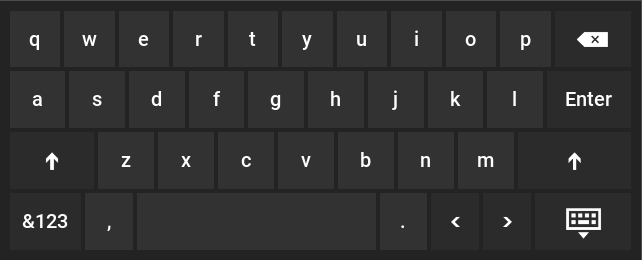

This is the Godot 4 version of [Godot-Onscreen-Keyboard]([myLib/README.md](https://github.com/martinfuchs/Godot-Onscreen-Keyboard))

# Usage
Onscreen Keyboard Plugin for Godot Engine. Displayed as soon as LineEdit or TextEdit are in focus.

# Installation

- add onscreenkeyboard as git submodule into addons or download .zip and add folder manually
 ```
	cd /path/to/project
	mkdir -p addons
	cd addons
	git clone https://github.com/Gouellie/Godot-4-Onscreen-Keyboard.git
```
- activate plugin: Project Settings -> Plugins -> Onscreen Keyboard
- create node: Create New Node -> OnscreenKeyboard

# Custom styles
Select your OnscreenKeyboard object and apply your custom styles and font via inspector. (You can find some default dark-flat-like-styles inside the plugin/customize/styles folder)

# Custom key-layouts
You can find some layouts inside plugin/customize/keyboardLayouts. 

!Dont forget to add *.json to your export resources. -> Export -> Resources -> Filters to export non-resource ...

# Create key-layouts

## Key values

### "type"
define type of the key-button
types are: ```char, special, special-shift and switch-layout```

#### type: char
every key-release triggers value for key "output" with current uppercase state. ("output" value always in uppercase)
all usable output-values can be found in keylist.gd

```
{
	"type": "char",
	"output": "E",
	"display": "e",
	"display-uppercase": "E"
}
```

#### type: special
applies optional custom-style for special-keys (see: set custom key-layouts)
every key-release triggers value for key "output" with current uppercase state. ("output" value always in uppercase)
all usable output-values can be found in keylist.gd

```
{
	"type": "special",
	"output": "Return",
	"display": "Enter",
}
```

#### type: special-shift
triggers shift-function on key-release.

```
{
	"type": "special-shift",
	"display-icon": "PREDEFINED:SHIFT",
	"stretch-ratio": 1.5
}
```

#### type: switch-layout
use this type to create a button able to toggle the visible layout (eg. multi language keyboards). toggles layouts with same ```name``` in ```layout-name``` 
 (```"layout-name": "PREVIOUS-LAYOUT"``` displays the previous layout on key-release.)
 (see .json structure)
```
{
	"type": "switch-layout",
	"layout-name": "special-characters",
	"display": "&123"
}
```


### "output"
every key-release triggers value for key "output" with current uppercase state. ("output" value always in uppercase)
all usable output-values can be found in keylist.gd

### "display"
visible string if lowercase is active

### "display-uppercase"
visible string if uppercase is active

### "stretch-ratio"
float value. set this above 1 if you want to stretch the visible key width, or below 1 to minimize it.

### "display-icon"

#### use predefined key-icons: 

use parameter "PREDEFINED" with SHIFT, LEFT, RIGHT, HIDE or DELETE

```
"display-icon": "PREDEFINED:SHIFT"
```

#### use custom key-icons:

use your custom icon directory (inside your project resources)
```
"display-icon": "res://test.png"
```

## .json structure
A file can define multiple layouts. Each layout is defined by rows and key values. 

```
{
	"debug": false,
	"layouts": [
		{
		"name": "layout-1",
		"rows": [
				{
					"keys": [
						{
						 ...
						},
						{
						 ...
						},
						{
						 ...
						},
					]
				},
				{
					"keys": [
						{
						 ...
						},
						{
						 ...
						},
						{
							"type": "switch-layout",
							"layout-name": "layout-2",
							"display": "display layout 2"
						}
					]
				}
			]
		},
		{
		"name": "layout-2",
		"rows": [
				{
					"keys": [
						{
						 ...
						},
						{
						 ...
						},
						{
						 ...
						},
					]
				},
				{
					"keys": [
						{
						 ...
						},
						{
						 ...
						},
						{
							"type": "switch-layout",
							"layout-name": "layout-1",
							"display": "display layout 1"
						}
					]
				}
			]
		}
	]
}
			
```
